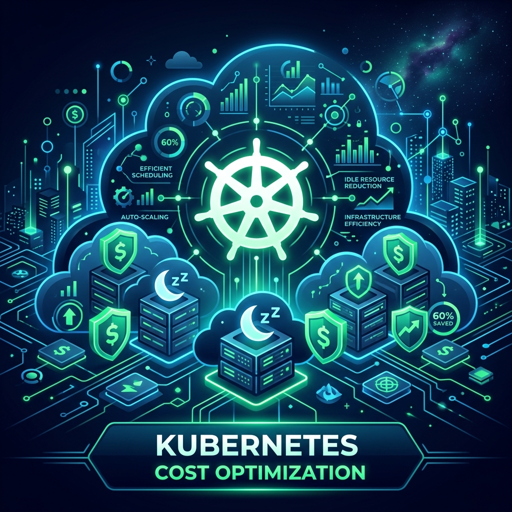
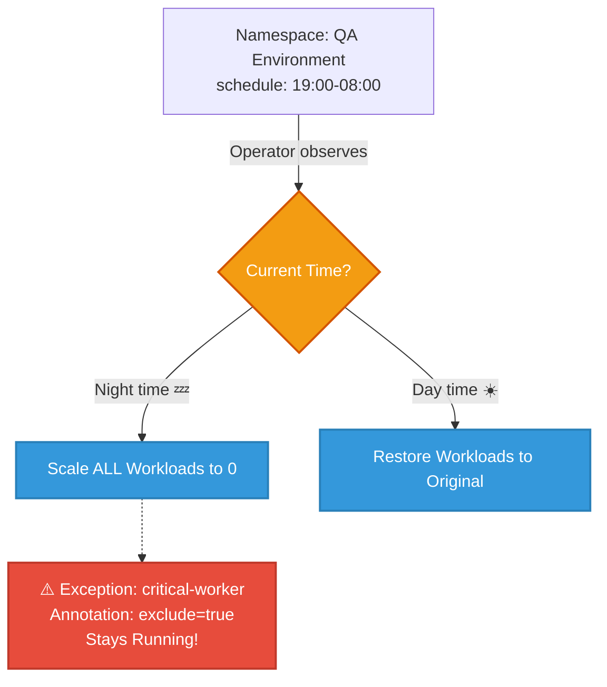
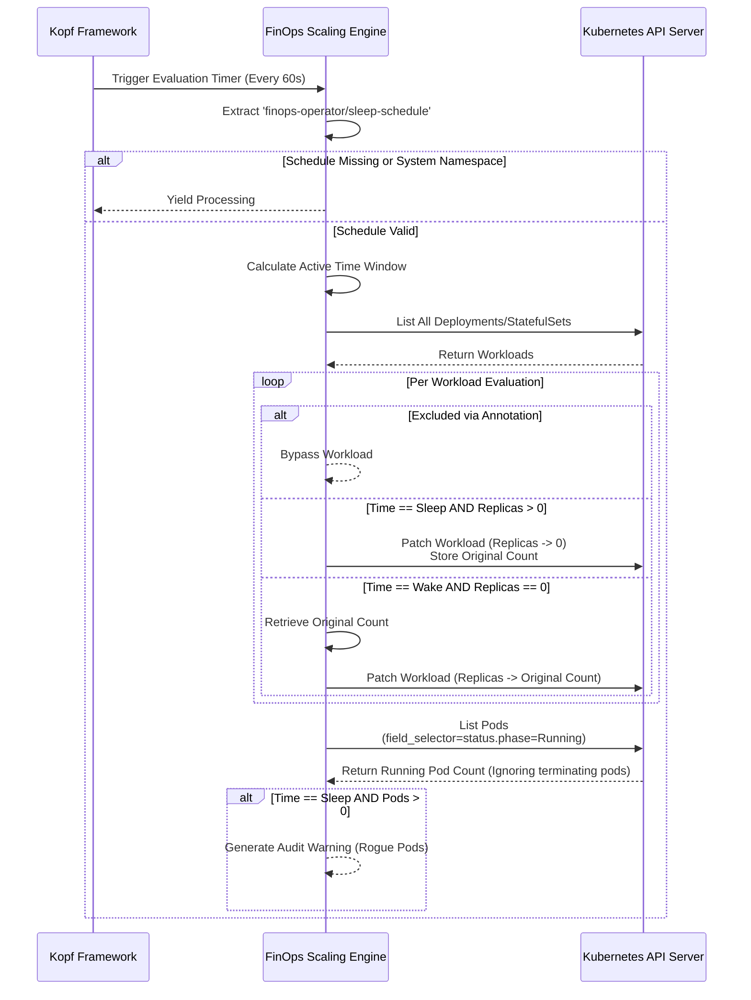

# 🌿 FinOps Kubernetes Operator

<p align="center">
  
</p>

[](https://opensource.org/licenses/MIT)
[](https://python.org)
[](https://kubernetes.io/)

A lightweight, high-performance Kubernetes operator designed to radically reduce cloud costs by intelligently scaling down non-production workloads (Deployments and StatefulSets) during designated "sleep" windows (e.g., nights and weekends). Built with [Kopf](https://kopf.readthedocs.io/), it embraces GitOps and declarative infrastructure principles to seamlessly blend into modern platform engineering ecosystems.

---

## 🚀 Key Features

*   **Declarative Schedules**: Control down-scaling natively via Kubernetes annotations on Namespaces.
*   **High Performance**: Leverages deep Kubernetes API server-side filtering (`field_selector`) instead of computationally expensive client-side loops for pods.
*   **Granular Exclusions**: Developers can opt-out specific workloads, ensuring mission-critical pods stay up even in "sleep" namespaces.
*   **Safe by Design**: Automatically skips system namespaces (`kube-system`, `kube-public`, `kube-node-lease`) and works gracefully alongside workloads undergoing termination.
*   **Audit Logging**: Actively scans for rogue running pods during sleep windows and tracks anomalies.
*   **Local & Cluster Ready**: Gracefully falls back to local `kubeconfig` during local development without manual intervention.

---

## 🏗 Architecture

### High-Level Concept

This visualizes the core **Opt-Out** FinOps mechanism. A single annotation on a namespace dictates the behavior of all non-critical compute workloads within it.



---

### Internal operator Logic Flow

Under the hood, the operator utilizes a unified scaling engine to iteratively evaluate conditions within the target bounds while prioritizing graceful state preservation.



---

## 💻 Usage & Annotations

To have the operator manage your resources, simply apply the necessary annotations and labels:

### 1. Activating a Namespace
You need to tell the finops-operator what namespaces workloads to scale down and when to scale them back up. Add an annotation with your desired window (UTC) on the namespace:
For example, if you want to scale down workloads in the `default` namespace from 7 PM to 8 AM UTC, you would add the following annotation:

```sh
kubectl annotate ns default finops-operator/sleep-schedule="19:00-08:00"
```

> **Warning - Opt-Out Architecture:** Once a namespace is activated, **EVERY** Deployment and StatefulSet inside it will be scaled down during the sleep window by default.

The operator proactively ignores any namespace whose name belongs to standard control plane resources (`kube-system`, `kube-node-lease`, `kube-public`) even if annotated.

### 2. Exemptions / Exclusions
If a specific workload within an activated namespace needs to stay up (e.g. a worker node processing long queues or a database), you must explicitly exclude it with `finops-operator/exclude: "true"` annotation like below:

```yaml
apiVersion: apps/v1
kind: Deployment
metadata:
  name: critical-worker
  annotations:
    finops-operator/exclude: "true"
```

---

## 🛠 Installation & Setup

### Requirements
* A Kubernetes Cluster
* Helm 3.x

### Approach 1: Quick Install (Pre-built Public Chart)
The fastest way to get started is to use the officially published Helm Chart and Docker Image. Because the packages are public, **no login is required**.

<!-- x-release-please-start-version -->
```bash
helm install finops-operator oci://ghcr.io/ok-karthik/helm-charts/finops-k8s-operator --version 1.1.0 -n finops-operator --create-namespace
```
<!-- x-release-please-end -->

### Approach 2: Build & Run Locally
If you wish to fork, develop, and publish the operator to your own internal enterprise registry:

**1. Building the Image**
<!-- x-release-please-start-version -->
```bash
docker build -t ghcr.io/<your-org>/finops-operator:1.1.0 .
docker push ghcr.io/<your-org>/finops-operator:1.1.0
```

To pull the latest published image directly:
```bash
docker pull ghcr.io/ok-karthik/finops-k8s-operator:1.1.0
```
<!-- x-release-please-end -->

**2. Helm Installation (Local Chart Directory)**

```bash
helm install finops-operator ./helm-chart/finops-k8s-operator -n finops-operator --create-namespace
```

#### Configuration Options

Customize via `values.yaml` or `--set` flags:

<!-- x-release-please-start-version -->
| Value                      | Description                         | Default                  |
|---------------------------|-------------------------------------|--------------------------|
| `image.repository`        | Container image to run              | `ghcr.io/ok-karthik/finops-operator` |
| `image.tag`               | Image tag                           | `1.1.0`                 |
| `image.pullPolicy`        | Image pull policy                   | `IfNotPresent`           |
| `serviceAccount.create`   | Whether to create a SA              | `true`                   |
| `rbac.create`             | Create RBAC resources               | `true`                   |
| `annotations`             | Annotations on SA/deployment        | `{}`                     |
| `scheduleInterval`        | Kopf timer interval (seconds)       | `60`                     |
<!-- x-release-please-end -->

> **RBAC note:** Kopf patches the namespace object when running a timer, so the operator requires `patch` permission on the `namespaces` resource. The supplied Helm chart grants `get,list,watch,patch` for namespaces. 

---

## 👨‍💻 Local Development

Run the operator locally seamlessly. The engine automatically detects the lack of an in-cluster environment and defaults to your local `~/.kube/config`.

```bash
pip install -r requirements.txt
kopf run operator.py --verbose
```

### Note on Naming
> **Warning**: The entrypoint is named `operator.py`. If you run standard python modules, try not to confuse this with the python built-in `operator` module! Ensure Kopf executes it via standard paths natively.

## 📦 Publishing the Helm Chart

You can package and publish the chart to an OCI registry (e.g. GitHub Packages):

<!-- x-release-please-start-version -->
```bash
# package locally (will create finops-k8s-operator-<chart-version>.tgz)
helm package helm-chart/finops-k8s-operator

# to an OCI registry:
helm registry login ghcr.io
helm push finops-k8s-operator-<chart-version>.tgz oci://ghcr.io/ok-karthik/helm-charts
```

The GitHub Actions workflow included in this repository will take care of building the container image and also packaging/pushing the Helm chart when you push a tag (e.g. `v1.1.0`).
<!-- x-release-please-end -->

## 🤝 Testing & Contributing

See `tests/` for unit and integration examples. Testing framework is currently under active development. Feel free to open a PR!

---

## 🔍 Operator in Action

Here is an example of what the operator logs look like when a sleep window activates and gracefully scales down workloads (while warning about rogue pods!):

```text
[14:33:52,373] kopf.activities.star [INFO    ] Activity 'configure' succeeded.
[14:33:52,373] kopf._core.engines.a [INFO    ] Initial authentication has been initiated.
[14:35:44,170] kopf.objects         [INFO    ] [crossplane-system] Sleeping Deployment: crossplane -> 0
[14:35:44,192] kopf.objects         [INFO    ] [crossplane-system] Sleeping Deployment: crossplane-rbac-manager -> 0
[14:35:44,219] kopf.objects         [INFO    ] [crossplane-system] Sleeping Deployment: upbound-provider-family-aws -> 0
[14:35:44,433] kopf.objects         [WARNING ] [crossplane-system] Audit: Namespace crossplane-system still has 1 running pods!
[14:35:44,452] kopf.objects         [INFO    ] [crossplane-system] Timer 'check_sleep_schedule' succeeded.
```

---

## 🌍 Architecture & Ecosystem Integrations

When designing a cloud-native FinOps strategy, this operator is designed to compose beautifully with existing CNCF tools:

### 1. Worker Node Scaling (Real Cost Savings)
The FinOps Kubernetes Operator scales *workload replicas* to exactly zero. To realize actual cloud bill savings (e.g., EC2/GCE instance costs), you **must pair this operator with an underlying compute autoscaler**. 

This couples perfectly with:
- [Kubernetes Cluster Autoscaler](https://github.com/kubernetes/autoscaler) or [Karpenter](https://karpenter.sh/) (AWS/AKS).
- Fully managed node-less control planes like [Amazon EKS Auto Mode](https://docs.aws.amazon.com/eks/latest/userguide/automode.html) or [GKE Autopilot](https://cloud.google.com/kubernetes-engine/docs/concepts/autopilot-overview).

As the FinOps operator gracefully drains the pods at night, the backing autoscaler or control plane will detect the drop in resource requests and safely terminate the empty worker nodes, ceasing your billing.

### 2. KEDA & Event-Driven Autoscaling
[KEDA](https://keda.sh) is fantastic for dynamic, metric-based scaling (e.g., queue length, HTTP traffic). By contrast, this FinOps operator is designed for **bulk, scheduled time-based scaling**. Instead of managing individual `ScaledObjects` for 50 microservices in a QA cluster, you simply activate the entire Namespace once.
* **Avoiding Conflicts:** If a Deployment is actively managed by KEDA or a native `HorizontalPodAutoscaler` (HPA), scaling it to zero might cause the HPA to fight the operator and scale it back up. **Best Practice:** Add the `finops-operator/exclude: "true"` annotation to any workloads managed by KEDA/HPA.
* **Roadmap:** Native integration with KEDA (dynamically injecting the `autoscaling.keda.sh/paused-replicas` annotation during sleep windows) is on the active roadmap!

### 3. Event-Based "Wake on Request"
The ultimate end-state for lower environments is "wake on request" (zero-to-one scaling). While this operator provides predictable scheduled sleeping (nights/weekends), combining our bulk-sleep architecture with tools like [Knative](https://knative.dev/) or the KEDA HTTP Add-on provides the perfect balance of guaranteed cost savings and seamless developer experience.

---

## ⚡ Performance & Efficiency

The operator is designed to be extremely "thrifty," ensuring that the tool you use to save money doesn't cost you money to run.

- **Footprint**: Consumes **< 1m CPU** and **< 100Mi Memory** in a standard environment with multiple namespaces and workloads.
- **API Efficiency**: Uses server-side `field_selector` filtering to reduce Kubernetes API traffic and memory overhead.

```bash
❯ kubectl top pod -n finops-operator
NAME                               CPU(cores)   MEMORY(bytes)
finops-operator-7cdb459d66-zxpjj   1m           99Mi
```
