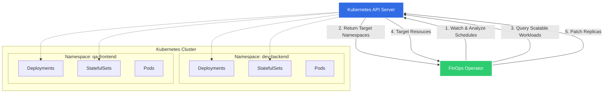
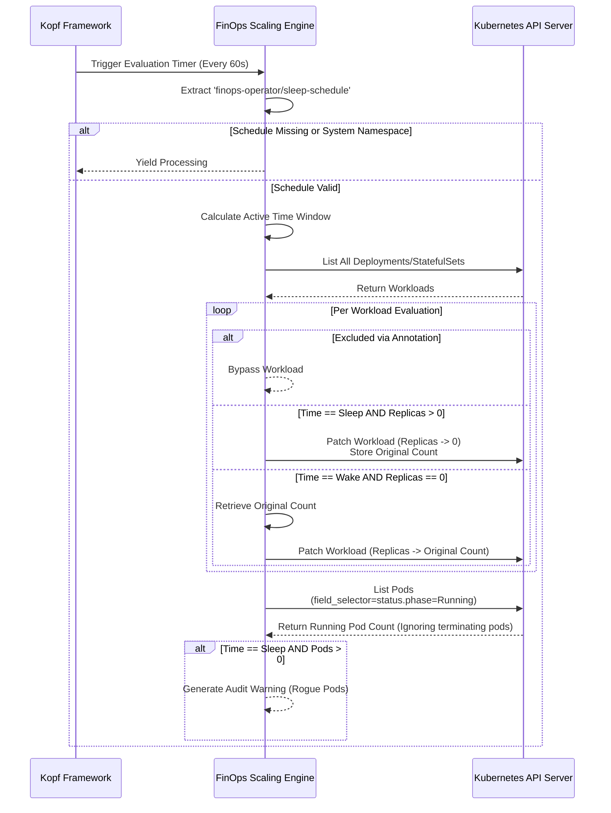

# 🌿 FinOps Kubernetes Operator

[](https://opensource.org/licenses/MIT)
[](https://python.org)
[](https://kubernetes.io/)

A lightweight, high-performance Kubernetes operator designed to radically reduce cloud costs by intelligently scaling down non-production workloads (Deployments and StatefulSets) during designated "sleep" windows (e.g., nights and weekends). Built with [Kopf](https://kopf.readthedocs.io/), it embraces GitOps and declarative infrastructure principles to seamlessly blend into modern platform engineering ecosystems.

---

## 🚀 Key Features

*   **Declarative Schedules**: Control down-scaling natively via Kubernetes annotations on Namespaces.
*   **High Performance**: Leverages deep Kubernetes API server-side filtering (`field_selector`) instead of computationally expensive client-side loops for pods.
*   **Granular Exclusions**: Developers can opt-out specific workloads, ensuring mission-critical pods stay up even in "sleep" namespaces.
*   **Safe by Design**: Automatically skips system namespaces (`kube-system`, `kube-public`, `kube-node-lease`) and works gracefully alongside workloads undergoing termination.
*   **Audit Logging**: Actively scans for rogue running pods during sleep windows and tracks anomalies.
*   **Local & Cluster Ready**: Gracefully falls back to local `kubeconfig` during local development without manual intervention.

---

## 🏗 Architecture

### High-Level Architecture

The operator operates continuously against the Kubernetes API, monitoring namespaces for predefined scheduling annotations and reconciling workload states to ensure adherence to cost-saving profiles.



---

### Internal operator Logic Flow

Under the hood, the operator utilizes a unified scaling engine to iteratively evaluate conditions within the target bounds while prioritizing graceful state preservation.



---

## 💻 Usage & Annotations

To have the operator manage your resources, simply apply the necessary annotations and labels:

### 1. Activating a Namespace
Before the operator can do anything you need to tell it when to sleep. Add an annotation with your desired window (UTC) on the namespace:

```sh
kubectl annotate ns dev-environment finops-operator/sleep-schedule="19:00-08:00"
```

> **Warning - Opt-Out Architecture:** Once a namespace is activated, **EVERY** Deployment and StatefulSet inside it will be scaled down during the sleep window by default.

The operator proactively ignores any namespace whose name belongs to standard control plane resources (`kube-system`, `kube-node-lease`, `kube-public`) even if annotated.

### 2. Exemptions / Exclusions
If a specific workload within an activated namespace needs to stay up (e.g. a worker node processing long queues or a database), you must explicitly exclude it:

```yaml
apiVersion: apps/v1
kind: Deployment
metadata:
  name: critical-worker
  annotations:
    finops-operator/exclude: "true"
```

---

## 🛠 Installation & Setup

### Requirements
* A Kubernetes Cluster
* Helm 3.x
* Docker (for building locally)

### Building the Image

```bash
docker build -t ghcr.io/<your-org>/finops-operator:0.12.0 .
docker push ghcr.io/<your-org>/finops-operator:0.12.0
```

To pull the latest published image:
```bash
docker pull ghcr.io/ok-karthik/finops-k8s-operator:0.12.0
```

### Helm Installation

You can install the chart directly from the OCI registry:
```bash
helm registry login ghcr.io
helm install finops-operator oci://ghcr.io/ok-karthik/helm-charts/finops-operator --version 0.12.0
```

#### Configuration Options

Customize via `values.yaml` or `--set` flags:

| Value                      | Description                         | Default                  |
|---------------------------|-------------------------------------|--------------------------|
| `image.repository`        | Container image to run              | `ghcr.io/ok-karthik/finops-operator` |
| `image.tag`               | Image tag                           | `0.12.0`                 |
| `image.pullPolicy`        | Image pull policy                   | `IfNotPresent`           |
| `serviceAccount.create`   | Whether to create a SA              | `true`                   |
| `rbac.create`             | Create RBAC resources               | `true`                   |
| `annotations`             | Annotations on SA/deployment        | `{}`                     |
| `scheduleInterval`        | Kopf timer interval (seconds)       | `60`                     |

> **RBAC note:** Kopf patches the namespace object when running a timer, so the operator requires `patch` permission on the `namespaces` resource. The supplied Helm chart grants `get,list,watch,patch` for namespaces. 

---

## 👨‍💻 Local Development

Run the operator locally seamlessly. The engine automatically detects the lack of an in-cluster environment and defaults to your local `~/.kube/config`.

```bash
pip install -r requirements.txt
kopf run operator.py --verbose
```

### Note on Naming
> **Warning**: The entrypoint is named `operator.py`. If you run standard python modules, try not to confuse this with the python built-in `operator` module! Ensure Kopf executes it via standard paths natively.

## 📦 Publishing the Helm Chart

You can package and publish the chart to an OCI registry (e.g. GitHub Packages):

```bash
# package locally (will create finops-k8s-operator-<chart-version>.tgz)
helm package helm-chart/finops-k8s-operator

# to an OCI registry:
helm registry login ghcr.io
helm push finops-k8s-operator-<chart-version>.tgz oci://ghcr.io/ok-karthik/helm-charts
```

The GitHub Actions workflow included in this repository will take care of building the container image and also packaging/pushing the Helm chart when you push a tag (e.g. `v0.12.0`).

## 🤝 Testing & Contributing

See `tests/` for unit and integration examples. Testing framework is currently under active development. Feel free to open a PR!
